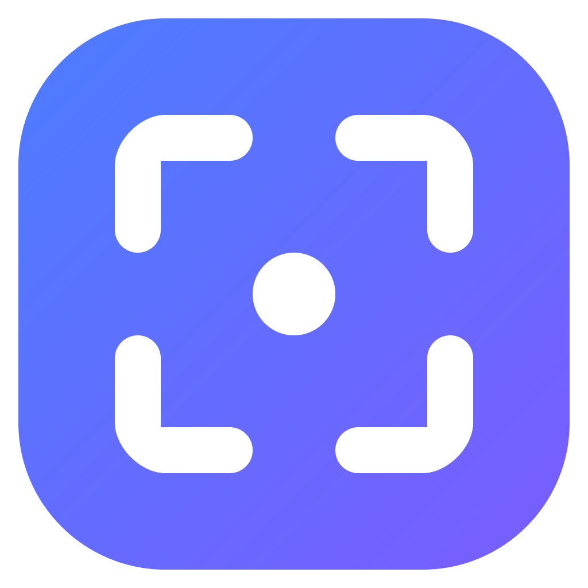
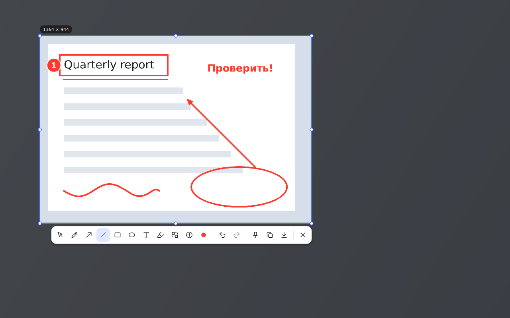
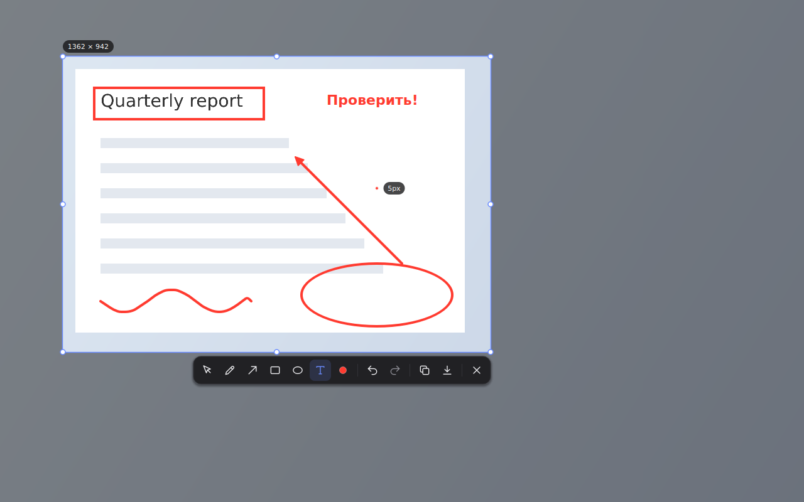
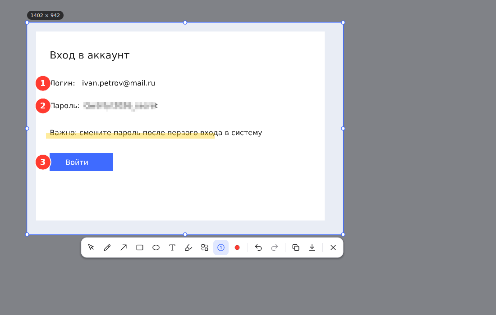
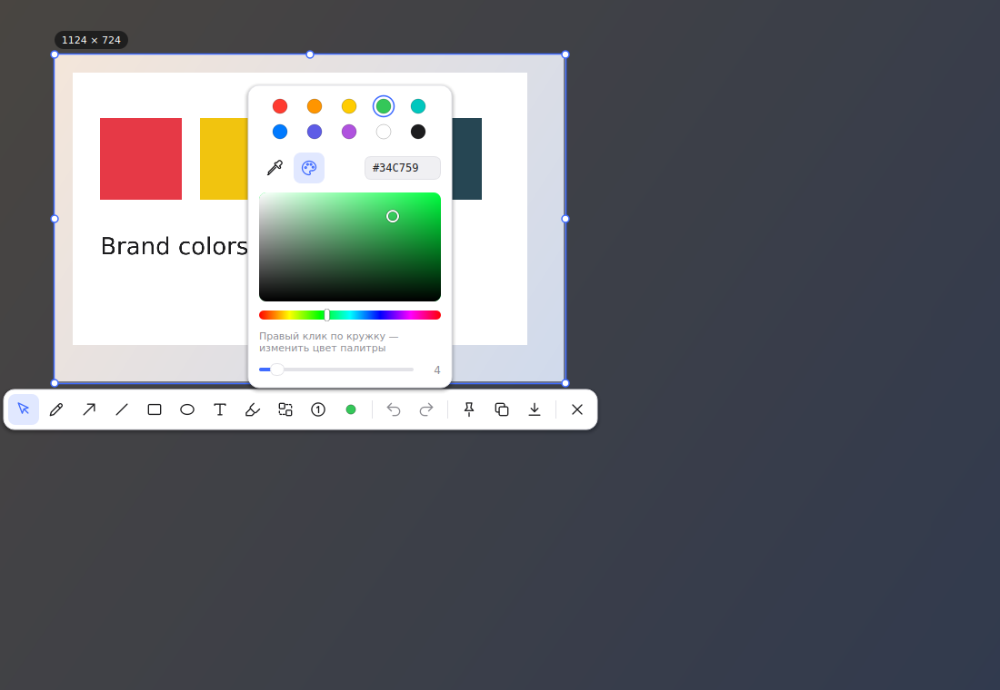
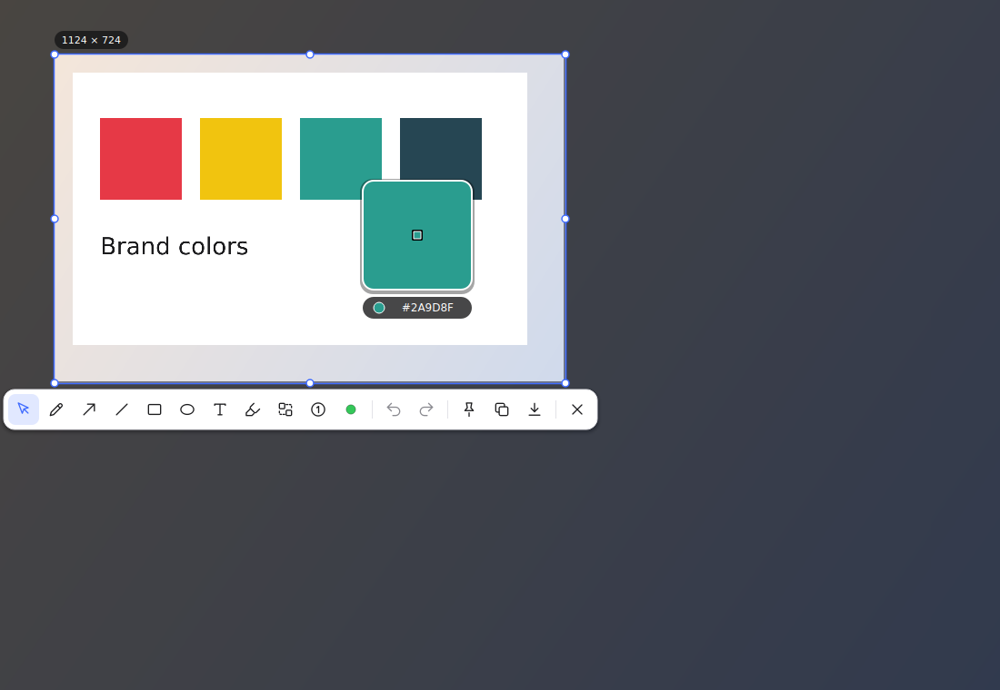
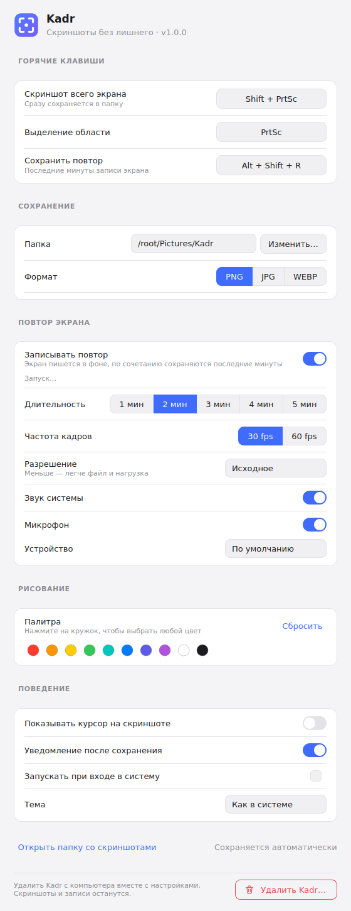
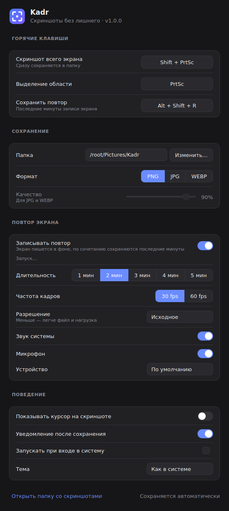

<div align="center">



# Kadr

**Скриншоты и повтор экрана — быстро, красиво, без лишнего.**
<br>Минималистичный аналог Lightshot с рисованием, undo/redo и записью последних минут экрана.

<br>

<!-- Номер версии прописывает сборка релиза (scripts/bump_readme.py) — вручную не трогать -->
<a href="https://github.com/tsarsvo/ScreenApp/releases/latest/download/Kadr-Setup.exe">
  
</a>

<sub><a href="CHANGELOG.md"><b>Что нового</b></a> · <a href="https://github.com/tsarsvo/ScreenApp/releases">все версии и портативная сборка</a> · Windows 10/11 · бесплатно</sub>

<br><br>

<a href="https://github.com/tsarsvo/ScreenApp/releases/latest"></a>
<a href="https://github.com/tsarsvo/ScreenApp/releases/latest"></a>
<a href="https://github.com/tsarsvo/ScreenApp/releases"></a>
<a href="https://github.com/tsarsvo/ScreenApp/actions/workflows/windows.yml"></a>


<br><br>




</div>

---

## ✨ Возможности

<table>
<tr>
<td width="50%" valign="top">

### 📸 Скриншоты
- **Весь экран одной клавишей**: файл сразу сохраняется в папку, без лишних окон
- **Выделение области** с плавным затемнением фона, ручками размера и размером в пикселях
- **Несколько мониторов** с разным масштабом (100% и 200% одновременно)
- Результат **копируется в буфер** или **сохраняется** в PNG / JPG / WEBP

</td>
<td width="50%" valign="top">

### 🖌 Рисование
- Кисть, стрелка, **прямая линия**, прямоугольник, овал, **текст**
- **Маркер**, **нумерованные шаги** ①②③ (их можно перетаскивать за кружок) и **пикселизация**, чтобы скрыть пароли и личные данные
- Линию, стрелку или фигуру можно **начать за рамкой**: часть за рамкой видна полупрозрачной, в снимок попадает только то, что внутри
- **Любой цвет**: палитра, выбор оттенка, HEX и **пипетка** прямо со скриншота
- **Свои цвета палитры**: правый клик по кружку, всё сохраняется
- Толщина — слайдером или **Ctrl + колесо**
- **Shift** — ровный квадрат, круг, стрелка и линия под 45°
- **Undo / Redo** — кнопками или `Ctrl+Z` / `Ctrl+Y`

</td>
</tr>
<tr>
<td width="50%" valign="top">

### ⏪ Повтор экрана
- Экран и звук пишутся в фоне, по `Alt+Shift+R` сохраняются **последние 1–5 минут** в `.mp4`
- Звук системы и **микрофон по выбору**
- Кодирование **видеокартой**: NVIDIA, AMD, Intel
- Сохранение за 1–2 секунды, на диске не больше нужных минут

</td>
<td width="50%" valign="top">

### ⚙️ Удобство
- Живёт в **трее**, клик по значку открывает настройки
- **Недавние снимки** в меню значка: скопировать заново, открыть или закрепить
- **Закрепить снимок поверх окон** (<kbd>Ctrl</kbd>+<kbd>T</kbd>): перетаскивание, размер — за край или колесом, прозрачность, **рисование прямо на снимке** и копирование в один клик
- **Автообновление**: новая версия ставится в один клик, с проверкой контрольной суммы; [история изменений](CHANGELOG.md)
- **Светлая и тёмная** тема, по умолчанию как в системе
- **Автозапуск** при входе в систему
- Горячие клавиши — **любая клавиша или сочетание**
- **Удаление в один клик** из настроек, с подтверждением

</td>
</tr>
</table>

<div align="center">

<br><sub>Маркер, нумерованные шаги и пикселизация, чтобы скрыть пароль</sub>
<br><br>


<br><sub>Выбор любого цвета и пипетка с лупой: наведите на нужный пиксель и кликните</sub>
<br><br>

&nbsp;&nbsp;

</div>

---

## 🚀 Установка

1. Скачайте **[Kadr-Setup.exe](https://github.com/tsarsvo/ScreenApp/releases/latest/download/Kadr-Setup.exe)**.
2. Запустите его. Права администратора не нужны.
3. Готово: ярлык **Kadr** появится на рабочем столе и в меню «Пуск», значок — в трее возле часов.

> [!TIP]
> Не хотите устанавливать? В [релизе](https://github.com/tsarsvo/ScreenApp/releases/latest) есть **`Kadr-portable.zip`**: распакуйте его и запустите `Kadr.exe`.

> [!NOTE]
> Windows SmartScreen может предупредить о «неизвестном издателе», потому что программа не подписана платным сертификатом. Нажмите **«Подробнее» → «Выполнить в любом случае»**.

<details>
<summary><b>Установка из исходников (для разработчиков)</b></summary>

<br>

**Windows, двойным кликом.** Установите [Python 3.10+](https://www.python.org/downloads/) с галочкой *Add python.exe to PATH*. Скачайте репозиторий (**Code → Download ZIP**), распакуйте и дважды кликните **`install_windows.bat`**. Скрипт сам поставит зависимости, скачает FFmpeg, создаст ярлыки и запустит программу.

**Вручную, на любой ОС:**

```bash
git clone https://github.com/tsarsvo/ScreenApp.git && cd ScreenApp
python -m venv .venv
# Windows:      .venv\Scripts\activate
# macOS/Linux:  source .venv/bin/activate
pip install -r requirements.txt
python main.py            # --region | --full | --settings | --save-replay
```

</details>

---

## ⌨️ Горячие клавиши

| Действие | Windows / Linux | macOS |
|:--|:--:|:--:|
| Выделить область | <kbd>PrtSc</kbd> | <kbd>Ctrl</kbd>+<kbd>Shift</kbd>+<kbd>2</kbd> |
| Весь экран → сразу в файл | <kbd>Shift</kbd>+<kbd>PrtSc</kbd> | <kbd>Ctrl</kbd>+<kbd>Shift</kbd>+<kbd>1</kbd> |
| Сохранить повтор | <kbd>Alt</kbd>+<kbd>Shift</kbd>+<kbd>R</kbd> | — |

Все три сочетания меняются в настройках: нажмите на кнопку и затем **любую клавишу или сочетание** (одиночные клавиши тоже можно). <kbd>Backspace</kbd> отключает сочетание.

**На выделенной области:**

| | | | |
|:--|:--|:--|:--|
| <kbd>V</kbd> выделение | <kbd>P</kbd> кисть | <kbd>A</kbd> стрелка | <kbd>R</kbd> прямоугольник |
| <kbd>E</kbd> овал | <kbd>T</kbd> текст | <kbd>Ctrl</kbd>+колесо — толщина | <kbd>Shift</kbd> — ровные фигуры |
| <kbd>Ctrl</kbd>+<kbd>Z</kbd> назад | <kbd>Ctrl</kbd>+<kbd>Y</kbd> вперёд | <kbd>Ctrl</kbd>+<kbd>C</kbd> / <kbd>Enter</kbd> копировать | <kbd>Ctrl</kbd>+<kbd>S</kbd> сохранить |
| <kbd>M</kbd> маркер | <kbd>B</kbd> пикселизация | <kbd>N</kbd> шаги ①②③ | <kbd>Ctrl</kbd>+<kbd>A</kbd> весь экран |
| <kbd>I</kbd> пипетка | ПКМ по кружку — свой цвет | <kbd>Ctrl</kbd>+<kbd>T</kbd> закрепить | <kbd>L</kbd> линия |

<kbd>Esc</kbd> или правая кнопка мыши закрывают выделение. На macOS вместо <kbd>Ctrl</kbd> используется <kbd>Cmd</kbd>.

**Мышью:**

| Действие | Как |
|:--|:--|
| Скопировать выделение | двойной клик внутри него (инструмент «Выделение», <kbd>V</kbd>) |
| Переместить / изменить выделение | перетащить его или белые точки по краям |
| Рисовать от края | начните линию, стрелку или фигуру за рамкой — часть за рамкой видна полупрозрачной, в снимок попадёт только то, что внутри |
| Передвинуть номер шага | взять за кружок (курсор-«рука») |
| Толщина кисти и размер текста | <kbd>Ctrl</kbd>+колесо |
| Закреплённый снимок | перетащить; край или угол — размер; колесо — масштаб; <kbd>Ctrl</kbd>+колесо — прозрачность; крестик справа вверху, двойной клик или <kbd>Esc</kbd> — закрыть |
| Рисовать на закреплённом снимке | карандаш в правом нижнем углу (появляется при наведении): три быстрых цвета, <kbd>Ctrl</kbd>+<kbd>Z</kbd> — отменить, рядом — копировать вместе с рисунком; ещё раз карандаш или <kbd>Esc</kbd> — выключить |

<details>
<summary><b>Если что-то не работает</b></summary>

<br>

- **Windows 11: <kbd>PrtSc</kbd> открывает «Ножницы».** Отключите это в *Параметры → Специальные возможности → Клавиатура → «Использовать PrtSc для открытия захвата экрана»* или назначьте в Kadr другое сочетание.
- **macOS.** Выдайте разрешения **Запись экрана** и **Универсальный доступ** в *Системные настройки → Конфиденциальность и безопасность* и перезапустите приложение.
- **Linux.** Полностью поддерживается X11. На Wayland система не даёт приложениям перехватывать клавиши и снимать экран: используйте сессию X11 или назначьте в настройках рабочего стола команду `main.py --region`.
- **Как удалить Kadr.** В самом низу настроек — кнопка **«Удалить Kadr…»**. Скриншоты и записи в папке сохранения останутся. Также можно через *Параметры Windows → Приложения*.
- **Повтор не сохраняется.** Проверьте в настройках строку под тумблером «Записывать повтор»: там видно, идёт ли запись и какой кодер используется.
- **Не снимается Диспетчер задач** (или другая программа, запущенная от администратора). Пока такое окно активно, Windows не передаёт обычным программам нажатия горячих клавиш. Включите в настройках тумблер **«Права администратора»**: Kadr будет запускаться с ними (Windows спрашивает разрешение при каждом запуске). Диспетчер задач с настройкой «Поверх остальных окон» Kadr на время выделения прячет и сразу возвращает — в снимок он попадает, а выделению не мешает.

</details>

---

## ⏪ Как работает повтор экрана

Включите тумблер **«Записывать повтор»** в настройках (по умолчанию он выключен). Пока запись идёт, на значке в трее горит красная точка.

```
 экран + звук ──▶ FFmpeg ──▶ [5с][5с][5с][5с]…  ◀── кольцо: старые куски перезаписываются
                                         │
                       Alt+Shift+R ──────┘──▶ склейка без перекодирования ──▶ Kadr_Replay_….mp4
```

- **Место на диске не растёт**: во временной папке лежат только последние минуты, около 250–300 МБ для 5 минут в 1080p.
- **Сохранение за секунду-две**: куски склеиваются без перекодирования, длина — выбранные минуты плюс до 5 секунд.
- **Кодер выбирается сам**: NVIDIA NVENC → AMD AMF → Intel Quick Sync → Media Foundation (есть в любой Windows). Если вариант не запустился, берётся следующий.
- **Настройки**: длительность 1–5 минут, 30 или 60 fps, разрешение (исходное / 1080p / 720p), монитор, звук системы, микрофон и выбор устройства.

---

## 🛠 Для разработчиков

<details>
<summary><b>Стек и почему именно он</b></summary>

<br>

**Python 3.10+ и PySide6 (Qt 6)**

| Задача | Решение | Почему не альтернатива |
|---|---|---|
| Кроссплатформенность | Qt работает нативно на Windows, macOS и Linux | C#/WPF — только Windows |
| Скорость и лёгкость | Нативная отрисовка, запуск за доли секунды, ~60–80 МБ ОЗУ | Electron тянет Chromium: 150–300 МБ и медленный старт |
| Захват экрана | `QScreen.grabWindow()` с HiDPI, запасной вариант — `mss` | — |
| Глобальные хоткеи | Windows: `RegisterHotKey` без хуков и прав. macOS/Linux: `pynput` | — |
| Рисование и анимации | `QPainter` с антиалиасингом, `QPropertyAnimation` | — |
| Повтор экрана | Вложенный FFmpeg: `ddagrab` (кадры сразу на GPU) + аппаратный кодер; звук системы — WASAPI loopback, микрофон — DirectShow | Кодировать видео из Python слишком медленно |

</details>

<details>
<summary><b>Архитектура</b></summary>

<br>

```
               ┌──────────── KadrApp (app.py) ────────────┐
 глобальный    │  трей · одна копия (QLocalServer) · тема │
 хоткей ──────▶│  HotkeyManager ──▶ capture / replay      │
               └──────┬──────────────┬───────────┬────────┘
                      │ full         │ region    │ replay
            grab_full_desktop()  grab_screens()  ReplayRecorder
                      │              │           (FFmpeg, кольцо сегментов)
                 save_image()   CaptureSession
                             (Overlay на каждый монитор)
                                     │
                     Overlay: выделение, фигуры, History
                     Toolbar + StylePopup (дочерние виджеты)
                                     │
                           render_selection() → QImage
                                     │
                  save_image() · буфер обмена · PinWindow · History (трей)

  Updater ── GitHub Releases API ──▶ Kadr-Setup.exe (sha256) ──▶ тихая установка
```

- **Отдельный оверлей на каждый монитор**: корректно работают экраны с разным масштабом.
- **Две системы координат**: интерфейс в логических пикселях, снимок в физических, поэтому результат на Retina/4K остаётся чётким.
- **Панели — дочерние виджеты оверлея**, а не отдельные окна: не отбирают фокус и не прячутся за окном «поверх всех».
- **Одна копия приложения**: замок-файл показывает, что Kadr уже запущен; повторный запуск передаёт команду (`--region`, `--save-replay` и т.д.) работающему процессу через `QLocalServer` и никогда не поднимает вторую копию.
- **Слой готовых фигур**: нарисованное хранится в отдельном буфере, новая фигура дорисовывается сверху. После <kbd>Ctrl</kbd>+<kbd>Z</kbd> или переноса шага пересобирается только изменённый кусок, выровненный по физическим пикселям, — без «швов» при масштабе 125–175 %.
- **История действий**: undo/redo хранит действия (добавить фигуру, передвинуть шаг) вместе с прежней рамкой выделения, если фигура её расширила.
- **FFmpeg привязан к Kadr**: на Windows — через Job Object, на Linux — `PR_SET_PDEATHSIG`. Даже если Kadr завершить через «Снять задачу», запись не останется работать в фоне.

</details>

<details>
<summary><b>Структура проекта</b></summary>

<br>

```
ScreenApp/
├── main.py                        точка входа
├── kadr/
│   ├── app.py                     трей, одна копия, хоткеи, запуск захвата
│   ├── config.py                  настройки → JSON (запись с задержкой, без лишних обращений к диску)
│   ├── capture.py                 захват экранов, склейка мониторов, курсор
│   ├── hotkeys.py                 горячие клавиши (Win32 RegisterHotKey / pynput)
│   ├── autostart.py               автозапуск: реестр / LaunchAgent / XDG
│   ├── saver.py                   PNG / JPG / WEBP, буфер обмена
│   ├── history.py                 «Недавние» снимки в меню трея
│   ├── pin.py                     закреплённый снимок поверх окон
│   ├── updater.py                 автообновление через GitHub Releases
│   ├── uninstall.py               удаление программы из настроек
│   ├── admin.py                   запуск с правами администратора (Windows)
│   ├── topmost.py                 Диспетчер задач не закрывает выделение (Windows)
│   ├── theme.py, icons.py         темы, тонкие SVG-иконки, логотип
│   ├── overlay/
│   │   ├── overlay.py             выделение, рисование, слой фигур, клавиши
│   │   ├── shapes.py              фигуры: кисть, стрелка, линия, рамки, текст, маркер, пикселизация, шаги
│   │   ├── history.py             undo / redo действий
│   │   ├── toolbar.py             панель инструментов и выбор цвета
│   │   └── session.py             оверлеи на все мониторы, общий результат
│   ├── replay/
│   │   ├── recorder.py            кольцо сегментов, запуск и сохранение
│   │   ├── ffmpeg.py              поиск FFmpeg, проверка кодеров, микрофоны
│   │   ├── audio_win.py           звук системы (WASAPI loopback)
│   │   └── child.py               FFmpeg завершается вместе с Kadr
│   ├── ui/                        окно настроек, тумблеры, выбор цвета
│   └── resources/                 логотип .svg / .png / .ico
├── scripts/
│   ├── build.py                   Kadr.exe + установщик (PyInstaller + Inno Setup)
│   ├── fetch_ffmpeg.py            загрузка FFmpeg (LGPL) с проверкой sha256
│   ├── smoke_exe.py               сквозная проверка собранного Kadr.exe в CI
│   ├── make_screenshots.py        картинки для README (docs/*.png)
│   ├── release_notes.py           описание релиза из CHANGELOG.md
│   └── bump_readme.py             номер версии на кнопке «Скачать»
├── docs/                          картинки для README
├── installer/kadr.iss             сценарий установщика
├── install_windows.bat            установка из исходников двойным кликом
├── tests/                         pytest, работают без дисплея
├── CHANGELOG.md                   история изменений
└── .github/workflows/windows.yml  тесты, сборка, проверка exe и релизы
```

</details>

<details>
<summary><b>Тесты, сборка и выпуск версии</b></summary>

<br>

```bash
pip install pytest pyinstaller
QT_QPA_PLATFORM=offscreen python -m pytest -q    # все тесты, дисплей не нужен

python scripts/fetch_ffmpeg.py                    # Windows: FFmpeg в kadr/bin
python scripts/build.py                           # dist/Kadr-Setup.exe и dist/Kadr-portable.zip
python scripts/make_screenshots.py                # обновить картинки в docs/ после изменений интерфейса
```

Каждый пуш и PR проверяются на Windows: тесты, сборка и **сквозной прогон настоящего `Kadr.exe`** — скриншот в WEBP, запись и сохранение повтора, отсутствие «зависших» FFmpeg после «Снять задачу».

**Как выпустить новую версию:**

1. Допишите в [`CHANGELOG.md`](CHANGELOG.md) раздел `## 1.2.3 — дата` и поднимите `DEFAULT_VERSION` в `kadr/__init__.py`.
2. Откройте **Actions → Windows build → Run workflow**, выберите ветку `main`, введите номер (`1.2.3`) и нажмите **Run workflow**.
3. Примерно через 5 минут в **Releases** появится **Kadr v1.2.3** с `Kadr-Setup.exe`, `Kadr-portable.zip` и описанием из `CHANGELOG.md`.

Дальше всё само: номер на кнопке «Скачать» обновится, а установленные копии Kadr предложат обновиться. Без раздела версии в `CHANGELOG.md` сборка остановится в самом начале — релиз без описания не выйдет. Можно и через git: `git tag v1.2.3 && git push origin v1.2.3`.

</details>

<details>
<summary><b>Как устроен автозапуск на Windows / macOS / Linux</b></summary>

<br>

Тумблер «Запускать при входе в систему» прописывает команду запуска в автозагрузку ОС. Права администратора не нужны. Если тумблер включён, запись обновляется при каждом старте, поэтому перенос папки с программой ничего не ломает.

**Windows** — значение в реестре (видно в *Диспетчер задач → Автозагрузка*):
```
HKEY_CURRENT_USER\Software\Microsoft\Windows\CurrentVersion\Run
    Kadr = "C:\...\Kadr.exe"
```

**macOS** — LaunchAgent `~/Library/LaunchAgents/app.kadr.screenshot.plist` с `RunAtLoad`:
```xml
<dict>
  <key>Label</key><string>app.kadr.screenshot</string>
  <key>ProgramArguments</key><array><string>/path/to/Kadr</string></array>
  <key>RunAtLoad</key><true/>
</dict>
```

**Linux** — XDG Autostart `~/.config/autostart/kadr.desktop` (GNOME, KDE, XFCE, Cinnamon, MATE, LXQt):
```ini
[Desktop Entry]
Type=Application
Name=Kadr
Exec="/usr/bin/python3" "/path/to/main.py"
X-GNOME-Autostart-Delay=2
```

</details>

---

<div align="center">
<sub>FFmpeg распространяется в LGPL-сборке как отдельная программа; текст лицензии лежит рядом с <code>ffmpeg.exe</code>.</sub>
</div>
